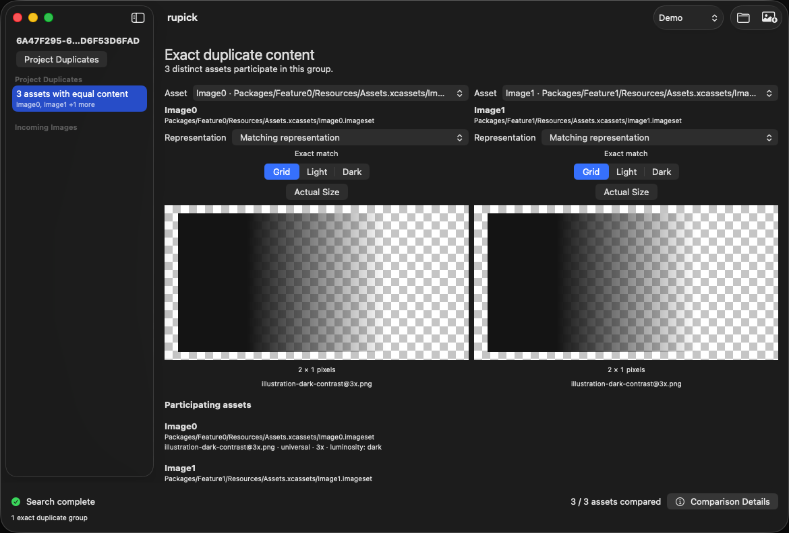
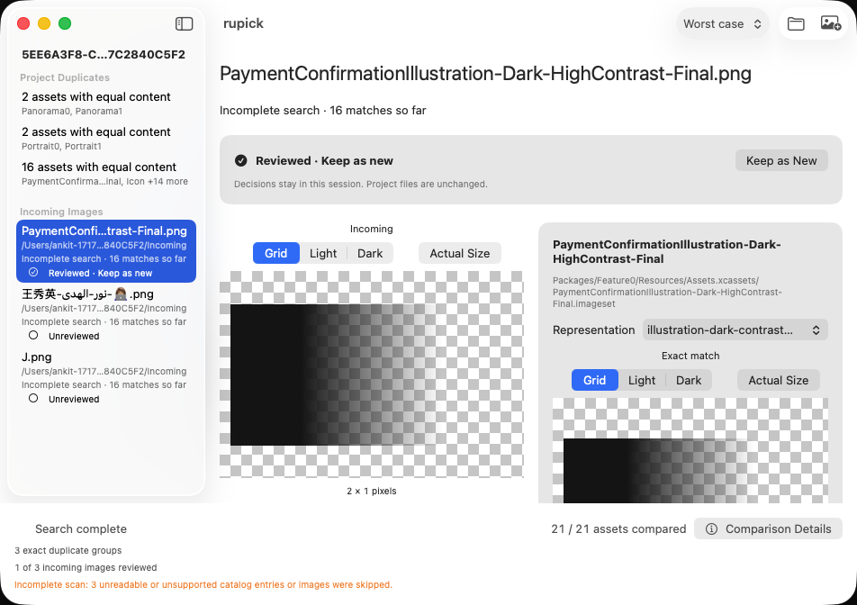
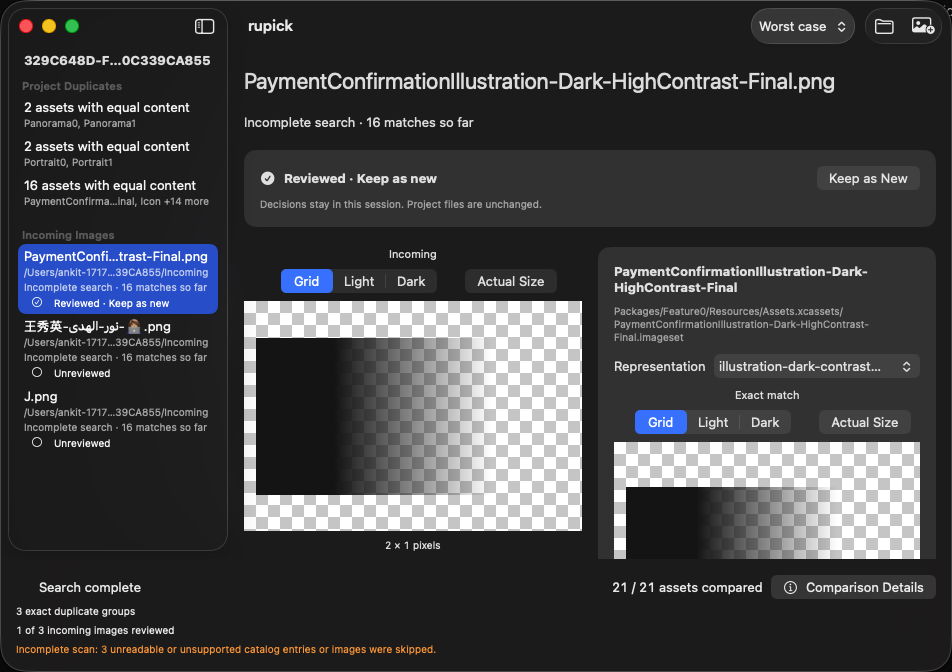
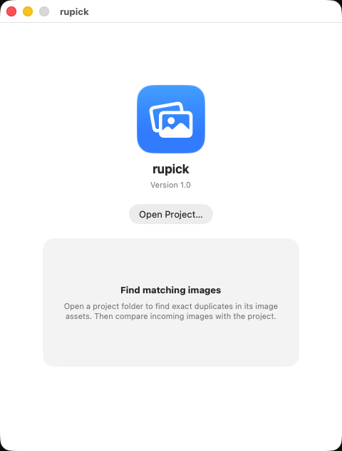
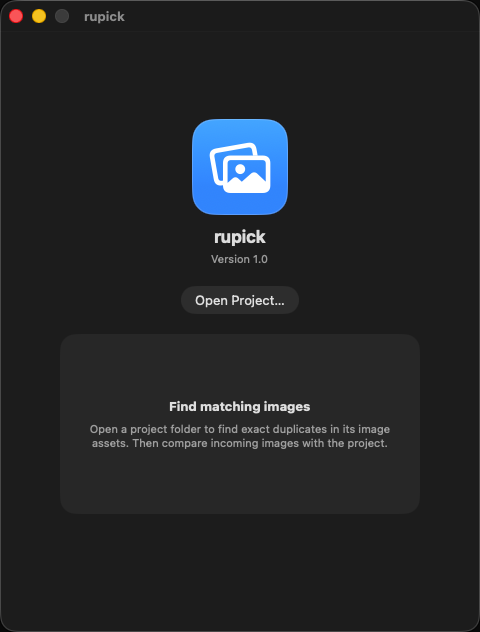

# Exact-match and batch acceptance

The agreed seams are the observable `ProjectSession` and the running native macOS app, as specified in #3 and implemented for #4. No matching-helper or cache-layout tests are used.

`fixtures/ExactMatching` is a synthetic project with two catalogs sharing the name Icon, light and dark scale variants, a corrupt catalog, and incoming images covering renamed/re-encoded content, transparent hidden colour, a new visible colour, dimensions, padding, partial alpha, and corruption. Expected results are in `expectations.json`. Regenerate it deterministically with:

```sh
python3 scripts/make-fixtures.py fixtures/ExactMatching
```

For manual native acceptance, run Rupick, use **Open Project…** to select the fixture root, and use **Choose Images…** for the Incoming files. Renamed and hidden-colour images each yield two distinct Icon entries; the remaining valid inputs yield no matches, and broken.png shows an error. Select an incoming image in the sidebar, inspect it and the candidate images side by side, select the 2x dark alternative, and verify it is labelled Alternative. Check that the incomplete-scan notice remains visible for the broken catalog, and that the exact-only limitation appears at the bottom.

For a larger project, use a renamed copy of a known catalog PNG or JPEG and a known new PNG or JPEG, keeping these copies outside the project. Compile and run the **same session implementation** through the local validation executable:

```sh
swiftc -swift-version 6 -parse-as-library \
  rupick/ProjectSession.swift rupick/ProjectResources.swift rupick/ProjectObservation.swift rupick/ThumbnailStore.swift \
  rupick/CatalogComparison.swift rupick/ProjectIgnoreRules.swift rupick/IncomingQueue.swift \
  scripts/validate-project.swift -o /tmp/rupick-validate
/tmp/rupick-validate /path/to/project /path/to/duplicate.png /path/to/new.png
```

It also re-encodes the duplicate with different metadata and adds a corrupt input. It fails on a missed or changed duplicate result, a false exact match, an unreadable valid input, an unreported corrupt input, or a scan failure. Progress and main-actor heartbeats verify the session remains responsive. This executable is supplemental: the native UI test remains the primary acceptance path and exercises sandbox access through actual file panels.

To repeat native UI acceptance against another project, create `/tmp/rupick-acceptance.json` locally with keys `root`, `duplicate`, and `newImage`, each containing an absolute path. Optionally add `batchFolder`, a folder containing the duplicate, new PNG/JPEG inputs, and `broken.png` (invalid image bytes), to exercise multi-selection and failure isolation. Run `rupickUITests/testRealProjectWhenAcceptanceConfigIsProvided` through Xcode or `xcodebuild -only-testing:rupickUITests/rupickUITests/testRealProjectWhenAcceptanceConfigIsProvided`. Without that file the optional test is skipped. Remove it afterward. Never commit this config, project images, paths, screenshots, test bundles, or logs from confidential projects.

During a large search, navigate existing results, open the image panel, cancel it, and select another incoming image. Confirm progress continues, provisional matches appear, and variant controls remain usable. Compare checksums of catalog contents before and after validation to confirm the project is untouched.

The deployment target is macOS 15 on Apple silicon (arm64). Debug and arm64 Release builds validate the deployment target and SDK availability checks. Runtime validation is performed on macOS 26.7.1 with Xcode 27.0 on Apple silicon; a macOS 15 runtime is unavailable in the current environment. Testing on that minimum runtime remains a release validation item, not a claimed test result.

## Batch acceptance (#5)

Native UI fixtures exercise multiple selection of the Incoming folder and a Finder batch drop, then navigate from a corrupt image to a duplicate and a new image. They also generate a JPEG input locally. The corrupt image shows recovery guidance without a no-match status; valid comparisons continue. Skipped catalog entries retain an incomplete-scan summary, and zero candidates are labelled incomplete rather than No matches found. The session boundary also covers a missing project root, cancellation, obsolete work, duplicate input URLs, and independent per-image statuses.

Finder drops accept local PNG/JPEG file URLs, preserve the drop order, and add each URL only once. Open a project first; unsupported dropped files and provider failures show recovery guidance. The image picker and Finder drops share the same ingestion path.

All zero-match messaging describes the search result only. The visible exact-match limitation explicitly says that no matches does not guarantee an image is safe to import. A failed scan, cancelled search, skipped catalog files, and provisional comparison never use the completed No matches found state.

Validation for #5 passed on the local macOS environment: native multi-selection and Finder batch ingestion, PNG/JPEG (including `.jpe`) acceptance, list navigation, side-by-side matches, isolated corrupt input, retained skipped-catalog warnings, completed no-match messaging, and a project removed before comparison. A separate local-project session run found the known duplicate, preserved the metadata/re-encoded match, rejected the known new image, and isolated corruption while publishing progress and main-actor heartbeats. Native local-project batch navigation also passed. Catalog-file checksums were unchanged. Confidential acceptance inputs, configuration, and test artifacts remain outside the repository.

## Project ignore rules

Discovery applies `.gitignore` files from the selected root and its subdirectories, including ordered negation, nested overrides, anchored paths, directory patterns, and wildcard/globstar patterns. Ignored directories are pruned before discovery. Ignored metadata and image representations are excluded from catalog comparison. These intentional exclusions do not count as unreadable/skipped files. Explicit incoming images still compare even when their paths match an ignore rule. Git's internal `.git` directories are excluded.

Rules are evaluated locally inside the app sandbox; no Git executable is required. The selected folder defines the boundary: parent ignore files, global Git excludes, `.git/info/exclude`, and Git's tracked-file index are not consulted. A path matching the project-local rules is excluded even if it was previously committed. Native fixtures include ignored duplicate and corrupt catalogs; session coverage exercises nested overrides, anchoring, negation, escaped literals/spaces, ranges, and globstars.

Local-project ignore validation matched Git's reference result and reported zero skipped files. The known duplicate, differently encoded copy, known new image, and corrupt-input isolation checks passed with progress and main-actor heartbeats. Native acceptance checks the expected included count and absence of an incomplete-scan warning through local-only optional `expectedAssets` and `expectedSkipped` config values.

## Existing project duplicates (#16)

Opening a project automatically scans its existing PNG/JPEG representations without incoming images. Select a duplicate group in the sidebar. Each group contains distinct asset locations and lists every matching representation's filename, scale, idiom, and appearance metadata. Two-member groups show fixed asset headings; larger groups offer independent Asset pickers for side-by-side inspection. Each Image file picker shows the selected filename and variant and exposes matches and alternatives. Shared background, Actual Size, and zoom controls apply to both previews. Select a duplicate group in the sidebar to return after incoming comparison.

Native synthetic tests cover a three-member group, a separate pair, same-named assets in different catalogs, alternatives, unique assets, ignored duplicate/corrupt catalogs, unreadable metadata, and a completed empty scan. Session tests cover exact normalized equality, transparent colour, dimensions/padding, self-match exclusion, repeated representations, incomplete scans, provisional groups, cancellation, and failure/reset. The existing incoming-image tests remain applicable.

The local validation executable now scans without incoming images first, verifies group uniqueness and distinct membership, and checks a group's complete membership against incoming comparison of its reference representation. The optional native acceptance configuration supports `expectedDuplicateGroups` alongside `expectedAssets` and `expectedSkipped`; positive group counts also require the native image-file controls. Keep local-project configuration, inputs, content manifests, screenshots, and test logs outside the repository.

Validation for #16 passed the full session/native UI suite and arm64 Release build. Local-project acceptance passed both Debug and optimized session runs and the native UI flow. Independent Git-rule catalog discovery and byte-content grouping agreed with every reported group. Full regular-file content hashes and symbolic-link targets remained unchanged, with a final post-UI inventory check. No confidential project identity, paths, images, configuration, or test artifacts are included in the repository.

## Interface stress fixtures

Debug builds support an opt-in fixture selector: launch with `RUPICK_STRESS_UI=1` in the scheme's environment. The toolbar offers Demo, Worst case, Empty, One, and 1,000 assets. Fixtures are generated locally in the app's temporary directory and cleaned up when replaced or the window closes; the selector and generator are absent in Release builds.

Worst case includes long asset names, deep locations, repeated names in different catalogs, Unicode/RTL/emoji names, transparent dark artwork, panoramic and tall images, missing alternative images, and an unreadable catalog. The other states exercise empty scans, singleton scans, and a thousand-member duplicate group. All datasets use the normal discovery and comparison path. Additional automated coverage checks thumbnail cache invalidation and cancelled requests, singular status text, and retaining inspection during a rescan while replacing results after project files change.

Check the minimum 950 × 620 window and a 220-point sidebar, larger windows, Light/Dark appearance, and increased accessibility contrast/text size. Confirm filenames remain distinguishable, full paths are available, warnings remain visible, and the final participant is reachable by scrolling. Compare previews on Grid/Light/Dark backgrounds and use Actual Size and its zoom slider to inspect transparency and pixel detail. Comparison Details must expose the read-only policy and exact-match limitations. Navigation and representation changes stay immediate; only the drop outline's exit and completion indicator use short opacity fades.

Large duplicate groups use a searchable asset chooser instead of unbounded pop-up menus.



Thumbnail decoding is serialized off the main actor and cached per window with limits of 128 entries and 32 MiB of decoded pixels. Cache keys refresh file modification time and size before lookup. Actual-size decoding obeys the comparison engine's 16-megapixel and 8,192-pixel-side limits. Routine progress snapshots are coalesced to at most ten updates per second, while phase changes, first matches, errors, and final results publish immediately. Each comparison refresh rereads catalog metadata and reconciles grouping; a bounded per-session cache reuses normalized pixels by source-byte identity. Inspected results remain provisional until replaced by the completed scan.

## Project lifecycle

`ProjectLifecycleTests` exercises the project interface with controlled scan completion and recorded file access. It covers fresh same-folder openings, obsolete picker/drop/scan callbacks, submission and file order, duplicate intake, mixed rejection, abandoned batches, cancellation with pending intake, inspection fallback, partial refresh retention, independent windows, and balanced access after retiring work. Native regression coverage verifies retained duplicate inspection, removed representation fallback, and a fresh opening through actual file panels.

Cancel Search retains accepted incoming images and provisional inspection while marking results incomplete. It discards unfinished intake, so late provider callbacks cannot restart the scan. A later picker selection or drop can start comparison again. Project closure invalidates callbacks immediately and lets workers and previews release their own access before removing generated fixture files.

## Review outcomes (#6)

Use the incoming-image review card to record **Keep as New**, including when candidates exist. Choose an exact matching representation on a candidate and select **Reuse This Asset** to record that catalog-entry identity, location, and matching image file. Alternatives remain inspectable but cannot be recorded as matching reuse. Review controls become available when the search stops; provisional results are still visible during scanning. The sidebar shows reviewed/unreviewed state and the footer counts reviewed incoming images. Navigate away and back to verify the outcome and inspected representation remain selected. Adding incoming images rescans the project while retaining decisions; opening a project resets them. Decisions are session-only and never modify project files.

Native acceptance exercises both outcomes, keeping as new with candidates, alternative rejection, representation selection retention, and navigation back to a recorded decision. The optional local-project native test exercises the same review flow. ProjectSession coverage verifies catalog identity, matching representation, independent per-image decisions, rescan retention, project reset, invalid identities, and byte-for-byte unchanged fixture contents. The local validation executable also verifies both outcomes, rescan retention, preserved candidates, and unchanged catalog-file hashes.

The debug fixture selector now includes incoming images through the normal comparison boundary. Set `RUPICK_STRESS_APPEARANCE=light` for a deterministic Light appearance during fixture validation. Worst case supplies long filenames and Unicode/RTL/emoji names; One and 1,000 assets exercise single-candidate and thousand-candidate review state. Empty supplies no incoming rows. Native stress acceptance reviews the worst-case incoming images and returns to duplicate inspection; session stress coverage records outcomes and rescans every dataset.

Motion uses native file panels, pickers, sheets, popovers, scrolling, progress controls, and button feedback. The asynchronous completion mark has a 160 ms strong ease-out opacity/scale transition (0.95 to 1); Reduce Motion uses only a 100 ms fade. The Finder drop outline exits with a 125 ms fade (100 ms with Reduce Motion) and appears immediately. High-frequency navigation, representation selection, and review actions remain immediate. For future motion changes, use the SwiftUI animation references and preserve these acceptance behaviors.

Recorded animation review verdict: **Approve**. No feel-breaking, layout-animation, timing, interruption, or reduced-motion findings. Reviewed `ContentView.swift` drop feedback, asynchronous completion feedback, native panels/popovers/sheets, and frequent inspection/review controls. The recorded review accepted these values (125–160 ms, strong ease-out, opacity/scale only, immediate high-frequency actions).

| Before | After | Why |
| --- | --- | --- |
| No motion defects identified in the final review | Native behavior and scoped completion/drop feedback approved | Short, interruptible feedback; no animated layout or delayed review/navigation; Reduce Motion retains gentle opacity feedback |

Stress validation also exposed a resize feedback loop when an inspection's lazily mounted header was offscreen. Inspection headers and controls now use regular stacks, while collection rows remain lazy. Native regression coverage resizes after scrolling to the final row and verifies toolbar/footer bounds. The geometry test starts at a known size within the display; the optional project test explicitly selects the new incoming row before asserting its status.





## Welcome screen

With no project selected, the window uses a compact 480 × 600-point content area (480 × 632 including the title bar on the validation system) and shows a centered app mark, app name and version, a native Open Project button, and a rounded guidance card. Opening a project expands the window to the 950 × 620-point minimum workspace, which remains resizable. The sidebar, comparison counters, and incoming-image controls appear after choosing a project. Native acceptance checks compact sizing in Light and Dark appearances, opening and cancelling the folder picker by click and Command-O, automatic workspace expansion, and transition into the existing project inspection flow. The welcome, native picker/representation, and scroll-layout tests passed after this change.






## Automatic catalog updates (#7)

Each open project session owns a native FSEvents observation through `ProjectObservationAdapter`. The stream watches the selected root recursively with file and root-change events and a 150 ms delivery latency. Metadata inventories run off the main actor, respect project-local ignore rules, and suppress duplicate notifications. Catalog files, directories and `.gitignore` changes trigger reconciliation; symbolic links and `.git` remain excluded. File identity, size, modification time and nanosecond change time identify replacements, metadata changes and permission changes. Recovery events reconcile the whole inventory.

Detected changes immediately invalidate old scan publishers and mark visible results provisional. A 250 ms quiet period coalesces edits before the final scan. The session preserves accepted incoming order and inspection until authoritative completion, then removes disappeared groups and representations, updates labels and completeness, and clears reuse decisions whose representation no longer matches. Thumbnail stores are replaced for each refresh. A per-session normalized-pixel cache uses SHA-256 source-byte identity and is bounded to 128 entries and 32 MiB. Unchanged cached images avoid repeated ImageIO/Core Image decoding; metadata enumeration and grouping still reconcile the entire included catalog. Files exceeding the cache budget are decoded as needed. Observation ends at project closure; retired inventory, workers and previews release their own read-only access before fixture cleanup. Failure to start observation shows recovery guidance.

`InterfaceRegressionTests` validates native observation through fixture catalog additions/removals, representation additions/removals, image corruption and recovery, metadata label changes, ignore-rule changes, preview invalidation and rapid atomic writes. `ProjectLifecycleTests` injects observation events and controls scan completion to verify obsolete results are rejected during the quiet period and after closure. Native UI regression waits for the inspected alternative to disappear automatically after a metadata edit, without choosing another image to refresh.

For local-project acceptance, use the existing local-only configuration and validator. To verify mutations, use a disposable local copy, add a synthetic catalog using a known duplicate, modify its metadata and image, then remove it. Wait for eventual session/native results after each operation. Keep all project identities, inputs, paths, manifests and output artifacts outside the repository. The original project must retain its complete regular-file and symbolic-link inventory.
